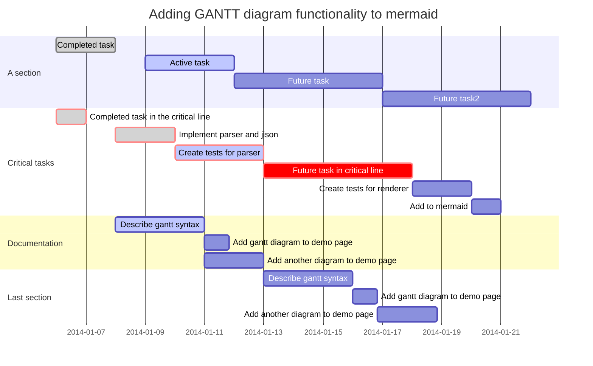
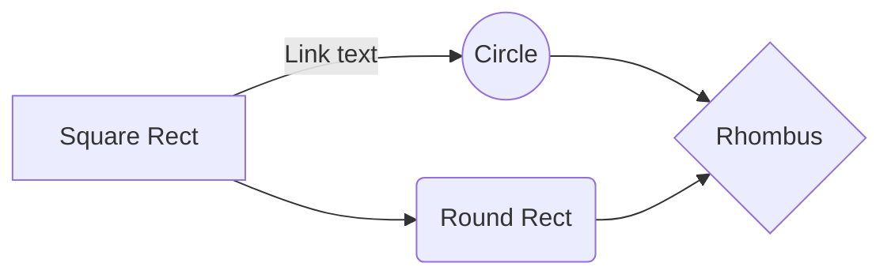
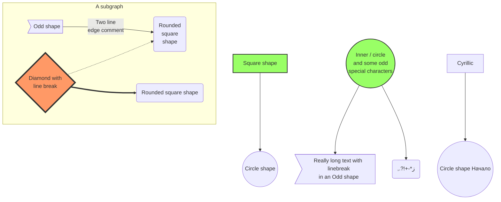
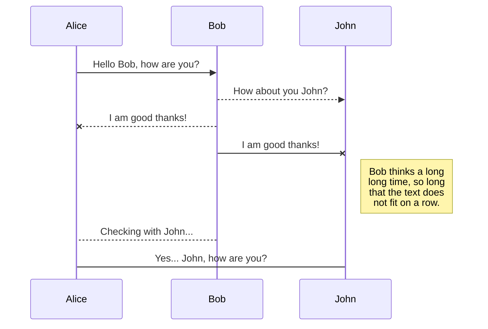
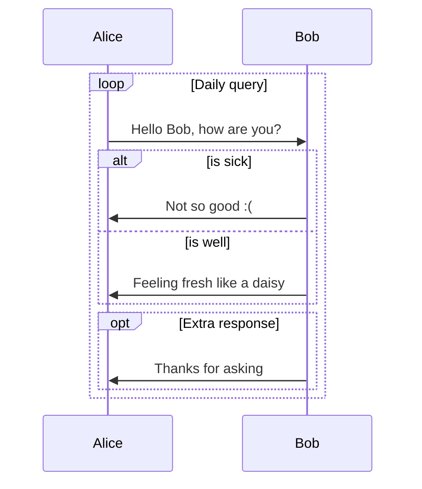
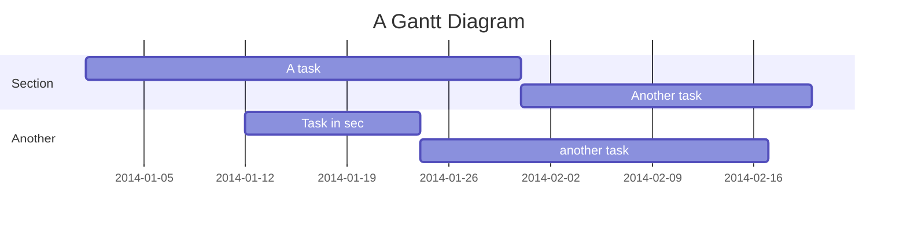
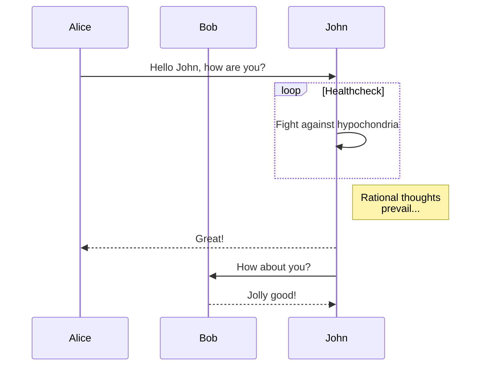
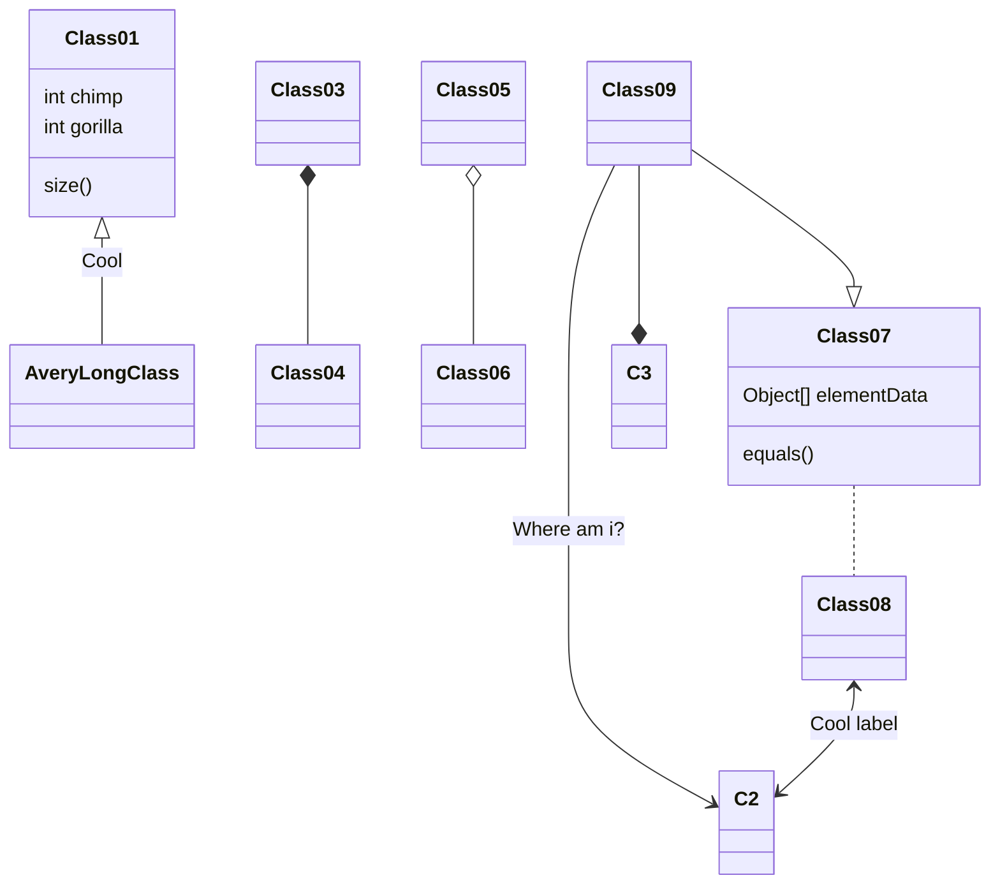

## Project Agenda

### 5. 有序列表

使用数字和点表示有序列表。

示例：

1. 有序列表项 一
2. 有序列表项 二
3. 有序列表项 三

```flow
st=>start: Start:>http://www.google.com[blank]
e=>end:>http://www.google.com
op1=>operation: My Operation
sub1=>subroutine: My Subroutine
cond=>condition: Yes
or No?:>http://www.google.com
io=>inputoutput: catch something...
st->op1->cond
cond(yes)->io->e
cond(no)->sub1(right)->op1
```

```sequence
Title: Here is a title
A->B: Normal line
B-->C: Dashed line
C->>D: Open arrow
D-->>A: Dashed open arrow
```

# (GitHub-Flavored) Markdown Editor

Basic useful feature list:

 * Ctrl+S / Cmd+S to save the file
 * Ctrl+Shift+S / Cmd+Shift+S to choose to save as Markdown or HTML
 * Drag and drop a file into here to load it
 * File contents are saved in the URL so you can share files


I'm no good at writing sample / filler text, so go write something yourself.

Look, a list!

 * foo
 * bar
 * baz

And here's some code! :+1:

```javascript
$(function(){
  $('div').html('I am a div.');
});
```

This is [on GitHub](https://github.com/jbt/markdown-editor) so let me know if I've b0rked it somewhere.


Props to Mr. Doob and his [code editor](http://mrdoob.com/projects/code-editor/), from which
the inspiration to this, and some handy implementation hints, came.

### Stuff used to make this:

 * [markdown-it](https://github.com/markdown-it/markdown-it) for Markdown parsing
 * [CodeMirror](http://codemirror.net/) for the awesome syntax-highlighted editor
 * [highlight.js](http://softwaremaniacs.org/soft/highlight/en/) for syntax highlighting in output code blocks
 * [js-deflate](https://github.com/dankogai/js-deflate) for gzipping of data to make it fit in URLs

## mermaid



















